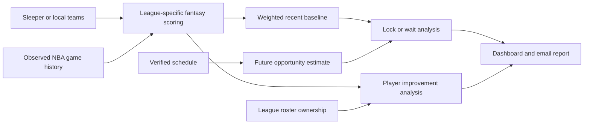

# LockIn

**A personal NBA fantasy dashboard for the scores worth keeping and the players worth noticing.**

LockIn brings multiple fantasy teams, player game histories, lock/wait analysis, and waiver research into one local interface. A Python statistical engine powers a colorful, responsive basketball dashboard with cached player portraits and an offline historical replay.

## What you can do

- Browse multiple teams, starters, bench players, portraits, and recent box scores.
- Get explainable **LOCK / WAIT** recommendations based on recent form and remaining opportunities.
- See explicit schedule, scoring, stale-data, and provider-error states instead of misleading confidence.
- Import NBA teams and league scoring from Sleeper using a username, without providing a Sleeper password.
- Keep Sleeper teams and practice rosters separate, with old seasons available as archives.
- Find players outperforming their earlier baseline, with minutes, consistency, sustainability, and roster-fit context.
- Play through **Test Week** morning by morning: reveal nightly scores, bank your choices, and resume saved progress offline.
- Generate a daily email report with data alerts and deduplicated pickup signals.

## The interface

The workspace includes a team switcher, full-roster/start/bench filters, searchable player rows, player detail panels, an **On the Rise** view, data alerts, and a Sleeper import dialog. Mint, lavender, coral, and amber distinguish decisions and team accents; condensed display typography and compact stat rows keep the emphasis on basketball.

The dashboard runs on your computer. It does not place locks, submit waivers, or change your Sleeper lineup.

## Quick start

Run commands in the directory containing this README and `app.py`.

```bash
python3 -m venv .venv
source .venv/bin/activate
python -m pip install -r requirements-dev.txt
python capture.py
python app.py
```

Open [the local dashboard](http://127.0.0.1:8765). `python gui_select.py` starts the same dashboard and opens your browser.

The capture command downloads a small set of immutable, archived NBA tables once and resumes from existing files. It saves data locally, chooses a complete week using a recorded seed, and writes provenance/checksums. Subsequent dashboard replay uses local data only. NBA Stats itself is not called by this capture path.

The application was verified in the existing Python 3.9/macOS environment. CI is configured for Python 3.11 and 3.12. Dependencies are declared explicitly; see [Operations](docs/OPERATIONS.md) for setup details and the existing environment's TLS compatibility pin.

## How the decision works



The lock model estimates whether any remaining game will beat the latest eligible performance:

```text
P(at least one future game beats current) = 1 − Φ((current − mean) / SD)^remaining_games
```

Recent games receive exponential weights. A longer-term prior stabilizes the mean, and conservative variance guards and rarity checks address limited history. Hand-tuned adjustments produce the final lock score.

The pickup engine asks a different question: has expected production improved? It compares five recent games with a separate earlier baseline, measures minutes and consistency, discounts potentially unsustainable shooting/steals/blocks, and compares compatible roster alternatives.

**These are explainable heuristics, not calibrated predictions or a proven optimal policy.** No win-rate or accuracy improvement has been established.

## Test Week

Open **Test Week** to start Monday morning. Reveal each night, inspect the recalculated model, bank one score per starter, and advance through Sunday. Practice roster edits and decisions stay separate from Sleeper and email. The simulator uses sample rules and does not claim historical fantasy ownership. [How to play](docs/TEST_WEEK.md).

## Historical dataset

The captured fixture contains **26,648 player-game records for 582 players** from the 2025–26 regular season, plus team-game schedules and 2024–25 prior-season observations. The seeded test week is **December 22–28, 2025**.

```bash
python main.py --date 2025-12-25
```

This produces a local report without email or NBA requests. Future observations are excluded from the decision and pickup calculations.

The data comes from an immutable revision of [llimllib/nba_data](https://github.com/llimllib/nba_data), an archive of NBA API data. The committed [manifest](data/fixture-manifest.json) records exact provenance and hashes; downloaded tables stay out of Git. Replay uses finalized historical schedules and a prior-season average, and does **not** claim historically accurate fantasy roster ownership. [Dataset details](docs/HISTORICAL_REPLAY.md).

## Sleeper and scoring coverage

Use **Sleeper connection** to import a username and season start year. The integration reads league rules and every roster, including reserve/taxi players, then identifies the user's own team. Imports are atomic: a failed league fetch preserves the previous configuration.

Some basketball leagues include technical/flagrant foul penalties absent from this dataset. Those teams show **SCORING GAP**, label displayed FP as partial estimates, and withhold lock recommendations. Pickup estimates carry the same limitation. Unrostered means absent from the latest league snapshot, not guaranteed immediately claimable.

## Reliability and privacy

- Request caching, host-level pacing, timeouts, and persistent cooldowns after failures or rate limiting.
- Cache-only replay; no hidden fallback to live requests.
- Required-stat validation and explicit unknown schedules.
- Preserved bonus flags, including the configured stacking rules.
- One canonical, atomically written `config.local.yaml` for UI and reporting.
- Loopback-only server, same-origin mutation checks, and CSRF tokens.
- Reports saved before delivery; daily email attempts and pickup alerts deduplicated.
- Local credentials, personal config, caches, portraits, and runtime state excluded from Git.

This repository previously committed an email credential. Removing tracked files does not revoke it; an exposed app password must be replaced. The local delivery guard blocks the identified password. See [security and remaining work](docs/KNOWN_ISSUES.md).

## Testing

```bash
python -m pytest -q
```

Tests block network connections and cover scoring boundaries, malformed data, unknown schedules, persistent cooldowns, roster persistence, atomic Sleeper import, future-data exclusion, pickup screening, and email deduplication. Real-dataset integration tests run when the local fixture is present. Browser verification covers desktop/mobile layout, team switching, player details, filtering, and roster editing.

## Documentation

| Guide | What it explains |
| --- | --- |
| [Walkthrough](docs/WALKTHROUGH.md) | The product, model, and daily workflow |
| [Architecture](docs/ARCHITECTURE.md) | Modules, data flow, persistence, and failure boundaries |
| [Model](docs/MODEL.md) | Scoring, equations, assumptions, and pickup logic |
| [Configuration](docs/CONFIGURATION.md) | Teams, settings, environment, and scoring coverage |
| [Operations](docs/OPERATIONS.md) | Setup, commands, troubleshooting, and email behavior |
| [Test Week](docs/TEST_WEEK.md) | Nightly simulation, score banking, persistence, and practice assumptions |
| [Historical replay](docs/HISTORICAL_REPLAY.md) | Capture provenance, time cutoffs, and evaluation limits |
| [Known issues](docs/KNOWN_ISSUES.md) | Remaining limitations and follow-up priorities |

## Engineering focus

Python, pandas, NumPy, Flask, vanilla JavaScript/CSS, and pytest. The frontend has no build step. Statistical calculations are separate from providers and notifications, making the same engine usable for local replay, live reports, and the dashboard.

The next evaluation milestone is a multi-week, held-out comparison against simple locking policies. No project license has been selected yet.
