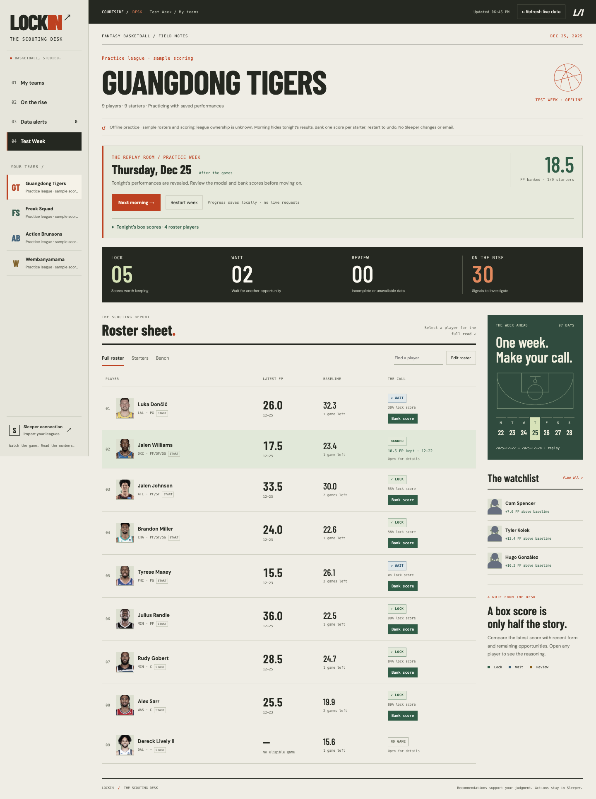
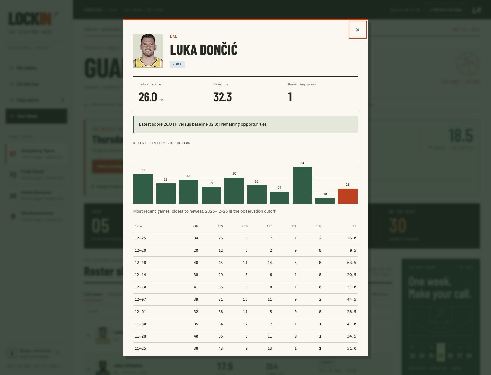
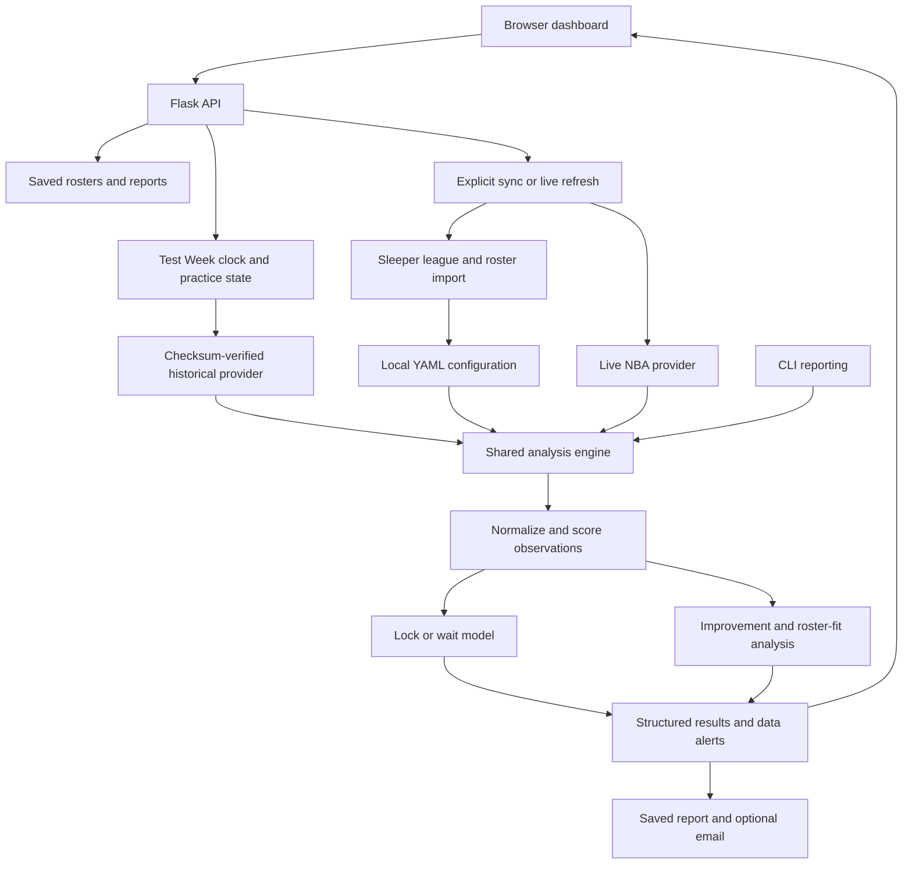

# LockIn

**A local NBA fantasy basketball dashboard that helps managers decide whether to keep a completed score or wait for another game.** LockIn combines league-specific scoring, recent player performance, remaining opportunities, and waiver research in one interface, with an offline practice week for exploring decisions.

Python · Flask · pandas · NumPy · vanilla JavaScript · pytest

## Screenshots and demo

The interface takes its visual cues from a printed basketball scouting report: warm paper, dark ink, court-orange accents, numbered navigation, a scoreboard strip, and a ruled roster sheet. These browser captures show historical/sample data, not current NBA recommendations.



*Test Week reveals one night's results at a time. Scores can be banked for starters and retained as the week advances. Expand “Tonight’s box scores” for the nightly breakdown.*



*Player details connect a recommendation to the observed performance and remaining opportunities.*

[View the mobile roster](docs/screenshots/mobile-roster.png). Small screens use a horizontal team selector and a compact roster; the baseline remains available in player details. Keyboard focus indicators, a skip link, and reduced-motion styles support navigation.

To try the workflow, follow [setup](#running-locally), select **Test Week**, reveal games, open a player, and bank an eligible score. Progress saves locally. There is no hosted demo.

## Problem and scope

A strong fantasy performance needs context: how unusual was it for this player, how many chances remain this week, and how does this league score the box score? Managing multiple teams also means tracking different rules and deciding whether a rising player would improve a particular roster.

LockIn brings those checks into one personal workspace. A manager imports Sleeper teams or uses sample rosters, reviews scores and explanations, and makes the actual league decisions in Sleeper. The repository implements the dashboard, Flask API, analysis engine, data adapters, local persistence, historical capture, practice simulator, report delivery, and tests. Sleeper supplies league data; NBA data supplies observations.

The app does not submit locks, waivers, or lineup changes to Sleeper. Its lock and pickup scores are **explainable heuristics, not calibrated predictions or a proven optimal policy**.

## Key features

- **Multi-team analysis:** separate league scoring, starters/bench filters, player histories, and saved archives for older Sleeper seasons.
- **Lock/wait explanations:** compare the latest eligible score with a weighted baseline and verified remaining opportunities; missing inputs produce explicit review states.
- **On the Rise:** compare five recent games with an earlier baseline, discount fragile improvement signals, and estimate fit against compatible roster players.
- **Offline Test Week:** reveal nights, bank one score per starter, edit practice rosters, and resume progress without changing live teams.
- **Read-only Sleeper import:** fetch leagues, scoring, and league-wide ownership from a username; preserve the previous team configuration if an import fails.
- **Local reporting:** save reports before optional email delivery, suppress repeated daily delivery attempts, and deduplicate pickup alerts.

## Tech stack

| Layer | Implementation |
| --- | --- |
| Interface | HTML, CSS, vanilla JavaScript; browser fetch, dialogs, and localStorage for the selected team; no frontend build step |
| Backend | Python and Flask, with one background worker for sync/refresh jobs |
| Analysis | pandas and NumPy for normalization, weighted statistics, and candidate screening |
| Persistence | PyYAML configuration, JSON snapshots/ledgers, Parquet through PyArrow; no database service |
| Integrations | nba_api endpoint definitions, Requests, Sleeper REST API, archived NBA tables, Gmail SMTP over TLS |
| Configuration | python-dotenv, checked-in sample YAML, ignored local overrides |
| Verification | pytest, Black, GitHub Actions configured for Python 3.11 and 3.12 |
| Runtime | Local Flask server on 127.0.0.1:8765; no production hosting configuration |

Exact direct dependency versions are in [requirements.txt](requirements.txt) and [requirements-dev.txt](requirements-dev.txt).

## How the system works


```mermaid
flowchart TD
    UI[Browser dashboard] --> API[Flask API]
    API --> Saved[Saved rosters and reports]
    API --> Practice[Test Week clock and practice state]
    API --> Jobs[Explicit sync or live refresh]
    Jobs --> Sleeper[Sleeper league and roster import]
    Sleeper --> Config[Local YAML configuration]
    Jobs --> Live[Live NBA provider]
    Practice --> Fixture[Checksum-verified historical provider]
    Live --> Engine[Shared analysis engine]
    Fixture --> Engine
    Config --> Engine
    Engine --> Score[Normalize and score observations]
    Score --> Lock[Lock or wait model]
    Score --> Pickups[Improvement and roster-fit analysis]
    Lock --> Report[Structured results and data alerts]
    Pickups --> Report
    Report --> UI
    CLI[CLI reporting] --> Engine
    Report --> Disk[Saved report and optional email]
```

1. The browser bootstraps its CSRF token, player directory, fixture metadata, and saved connection settings. Opening the live dashboard reads saved data; it does not implicitly fetch NBA statistics.
2. An explicit refresh uses the live provider. Test Week uses local fixture tables. Both call `engine.build_dashboard()` with a reference date and configuration.
3. The engine limits statistical inputs to observed games, resolves player identities, applies league weights, and gets schedules and priors from the selected provider. Decisions are reused within a report for the same player and scoring weights.
4. Lock analysis and pickup screening return structured results. Unsupported league scoring suppresses lock recommendations; missing schedules remain unknown rather than becoming zero remaining games.
5. The frontend displays results, explanations, and alerts. The CLI formats the same analysis for disk and optional email. Saved live analyses older than six hours or from another day lose actionable recommendations in the dashboard.

## Architecture and data model

| Files | Responsibility |
| --- | --- |
| [app.py](app.py), [web/](web/) | HTTP boundary, jobs, interface state, rendering, and user actions |
| [engine.py](engine.py), [providers.py](providers.py) | Shared orchestration and explicit live/replay input policies |
| [fetch_data.py](fetch_data.py), [scoring.py](scoring.py) | Identity/date normalization, box-score validation, bonus flags, fantasy points |
| [decide.py](decide.py), [model.py](model.py), [pickups.py](pickups.py) | Weekly decisions, statistical heuristics, rising-player screening |
| [simulation.py](simulation.py), [storage.py](storage.py) | Practice transitions, config validation, atomic file replacement |
| [sleeper.py](sleeper.py), [transport.py](transport.py), [capture.py](capture.py) | League import, cached/paced requests, historical capture |
| [main.py](main.py), [notify.py](notify.py) | Reports, delivery ledger, pickup cooldowns, SMTP |
| [tests/](tests/), [docs/](docs/) | Regression checks and implementation guides |

The main entities are **teams**, **player-game observations**, **practice runs**, and **reports**. A team contains a stable ID, roster names, a starter subset, and optional league weights and ownership metadata. Imported teams use `sleeper-<league_id>` IDs. Observations carry player/team/game IDs, dates, minutes, box scores, and derived bonuses. The engine maps roster names to NBA identities; there are no database foreign-key constraints.

| Local path | Stored data |
| --- | --- |
| `config.local.yaml` | Authoritative personal configuration; falls back to `config.yaml` when absent |
| `data/fixtures/2025-26/` | Game, schedule, and prior-season Parquet tables plus checksums |
| `data/cache/` | Archived downloads, HTTP responses/cooldowns, optional cached portraits |
| `state/test-week.json` | Practice configuration snapshot, date/phase, revision, banked scores |
| `state/` | Reports, Sleeper player metadata, email attempts, pickup alert history |

These generated/personal paths are ignored by Git. The shareable [fixture manifest](data/fixture-manifest.json) records provenance and counts.

### API and local security boundary

| Route | Purpose |
| --- | --- |
| `GET /api/bootstrap` | Session token and initial metadata |
| `GET /api/dashboard` | Saved live workspace or date-selected replay |
| `GET/POST /api/test-week` | Read practice state or advance, bank, edit, and reset |
| `POST /api/roster` | Persist local roster edits; imported rosters are managed in Sleeper |
| `POST /api/sync`, `POST /api/refresh` | Start background import/analysis; return a job ID |
| `GET /api/jobs/<id>` | Poll completion or failure |

The server binds to loopback, restricts trusted hosts, rejects requests marked cross-site, and requires JSON plus a session CSRF token for mutations. These protections support a local app; there is no user login, public authorization layer, or production server. Credentials stay in an ignored `.env` file.

## Engineering decisions and tradeoffs

The rationale below describes how each choice fits the implementation, rather than claiming an undocumented development history.

| Decision | Why it fits | Tradeoff | Alternative |
| --- | --- | --- | --- |
| One engine with live and fixture providers | Dashboard, CLI, and practice share scoring; fixture tests avoid provider availability | Historical schedule and prior policies differ from live inputs | Versioned provider contracts with timestamped historical snapshots |
| YAML/JSON with atomic replacement | Inspectable local persistence; interrupted writes do not expose a partially written target file | Atomic writes alone do not prevent lost updates across processes | SQLite transactions and schema migrations |
| Vanilla JS and Flask | Small deployment surface and no frontend build pipeline | UI state, rendering, and events concentrate in one script | Split frontend modules or a component framework as complexity grows |
| Explicit unavailable states | Provider failure cannot safely mean there are no remaining games | Required missing inputs prevent recommendations | Separately labeled fallback with evidence about its reliability |
| Record email attempt before SMTP | An ambiguous timeout does not trigger automatic duplicate sends | Failure can suppress a report that was never delivered | Durable outbox and a delivery service supporting idempotency keys |

## Technical challenges

**Keeping replay honest.** Morning practice and live analysis use observations through the previous day; night replay includes the selected day. Future rows are excluded from model and pickup inputs. Tests change future scores and confirm present results stay unchanged. Finalized schedules and current/sample ownership still limit realism. The lesson is to distinguish time-safe statistical inputs from a fully realistic backtest.

**Normalizing different scoring rules.** Core stats must be finite and nonnegative. Optional missing fields are tracked as imputed and rejected if the league assigns a nonzero weight. Double/triple-double and 40/50-point bonuses are recomputed and can stack. Unknown nonzero Sleeper rules create scoring gaps; flagrant fouls are deliberately excluded by policy. Missing, zero, and intentionally ignored must remain different data states.

**Handling unreliable external requests.** `CachedHTTP` combines persistent caches, host pacing, connect/read timeouts, and cooldowns. A filesystem lock serializes requests across processes; rate limits honor `Retry-After`. Imports build all team records before replacing configuration, although the player-directory cache can update earlier. This favors coherent team snapshots over partial progress, at the cost of serialized throughput.

**Protecting practice decisions from stale tabs.** Mutations require the current revision. An in-process lock protects read/check/write, and successful mutations generate a new revision. Banked players cannot be removed or toggled, roster edits happen only in the morning, and the week cannot advance past Sunday night. This prevents stale-tab overwrites within the intended single-server workflow; it is not a cross-process transaction system.

## Deep dive: from a box score to LOCK or WAIT

For a selected player, `per_player_week_decision()` in [decide.py](decide.py) follows this path:

1. Normalize observed logs, apply league weights, and select the latest completed game in the Monday–Sunday week. No eligible game yields `NO_GAME`; no history yields `NO_HISTORY`.
2. Build a baseline from the configured recent window (defaults: 14 days, at most 10 games, with older history as a fallback). `rolling_baseline()` weights recent games exponentially, blends the mean with an available prior, and applies variance floors for sparse samples. The current game participates in the performance baseline but is excluded from rarity comparisons.
3. Obtain a verified remaining-game count. An unavailable schedule yields `SCHEDULE_UNAVAILABLE` and `decision: null`; a verified zero is a valid model input.
4. Estimate the chance that at least one future performance exceeds the current score:

   ```text
   p_future_beats = 1 - Φ((current_fp - mean) / standard_deviation)^remaining_games
   ```

   This assumes independent future scores from the same Normal distribution. Replay uses a prior-season game average; the live provider uses season observations older than 14 days, not additional career requests.

5. Start the lock score at `1 - p_future_beats`, then apply rarity, small-sample, remaining-opportunity, and optional conservative-mode adjustments. Clamp to `[0, 1]`; scores at least `0.5` become `LOCK`. Those adjustments make the final value a heuristic preference, not a calibrated probability.
6. Return the score, baseline, opportunities, history, and explanation. The engine withholds actionable output when league scoring is incomplete. The user acts in Sleeper, or banks the score locally in Test Week.

Pickup analysis is separate: it needs at least 13 observations, compares the last five games with up to 20 earlier games, checks minutes and consistency, discounts shooting/steals/blocks spikes, and prefers a compatible bench replacement. It does not optimize every roster slot or model injuries.

## Running locally

Use macOS or Linux (or a compatible environment such as WSL): the HTTP and email locks use Unix `fcntl`. CI targets Python 3.11/3.12; the existing local environment runs Python 3.9.6. Run commands from the directory containing this README.

```bash
python3 -m venv .venv
source .venv/bin/activate
python -m pip install -r requirements-dev.txt
python capture.py
python app.py
```

Open [localhost:8765](http://127.0.0.1:8765), then select **Test Week** for the offline demo. `python gui_select.py` also starts the server and opens a browser. No database setup, Node installation, or email credentials are needed for practice.

The first capture needs internet access. It resolves the archive's current revision, records it locally, and reuses that revision/downloads on later runs. A fresh checkout can therefore capture a different revision from the committed manifest. Capture does not call NBA Stats or download portraits; missing portraits use a placeholder. Google Fonts are optional external resources with system-font fallbacks.

The committed manifest records **26,648 player-game observations, 582 players, and a December 22–28, 2025 test week**, with 2024–25 observations used for priors. These are dataset counts, not performance metrics. The fixture provider verifies local table checksums before replay.

```bash
# Historical report: local output, no email or NBA requests
python main.py --date 2025-12-25

# Explicit live analysis: requires working external providers
python main.py --live

# Offline regression tests and the formatter check used by CI
python -m pytest -q
python -m black --check *.py tests
```

Use a date from the newly captured manifest if its selected week differs. Tests block socket connections and cover scoring boundaries, missing inputs, future-data exclusion, import failure, cooldowns, API mutations, practice revisions, and email deduplication. Real-fixture tests skip until capture has run. CI does not include an automated browser suite.

For Sleeper, use **Sleeper connection** with a username and season start year; no password is requested. UI changes and reports share `config.local.yaml`. For optional email, copy the variable names from [.env.example](.env.example) into a local `.env`, set `EMAIL_USER` and `EMAIL_APP_PASSWORD`, and configure `notify.to_email`/`notify.from_email` in local YAML. Only `python main.py --live --send --daily` requests delivery. Scheduling is external to the app. See [Operations](docs/OPERATIONS.md) for details.

## Limitations and next improvements

- **Credential history:** previous project documentation records a committed email credential. The delivery guard checks a local blocked-password hash; it is not a general secret scanner. Confirm revocation and public-history cleanup before showcasing the repository. This README does not establish their current external status.
- **Evaluation:** no measured win-rate or calibration result exists. Compare policies across held-out weeks against simple baselines before making effectiveness claims.
- **Live/scoring fidelity:** provider availability varies; technical-foul and other unsupported rules withhold decisions. Sleeper lock selections are not imported, and ownership reflects the latest snapshot rather than guaranteed claimability.
- **Historical fidelity:** replay uses finalized schedules, last observed team assignments, and sample/current rosters. It lacks timestamped injuries, transactions, exact lock deadlines, and opponent simulation.
- **Concurrency and scale:** configuration updates have no cross-process transaction lock; job status and dashboard cache live in memory. Multiple workers/users would need transactional persistence, durable jobs, authentication, and deployment work.
- **Maintainability and presentation:** add browser regression tests, refresh the dependency/runtime baseline, make initial capture explicitly reproducible from the committed manifest, and choose a project license. Some implementation comments and older operational notes need reconciliation with current behavior.

## What this project demonstrates

- Full-stack implementation across a browser interface, Flask API, shared domain logic, and local persistence.
- Statistical decision modeling with explicit assumptions, sparse-data guards, and league-specific scoring.
- API integration with validation, caching, rate-limit handling, and visible failure states.
- Checksum-verified replay inputs, time-cutoff testing, and revision-based state transitions.
- Reliability tradeoffs around atomic writes and uncertain message delivery.

## Documentation and maintenance

| Guide | Focus |
| --- | --- |
| [Architecture](docs/ARCHITECTURE.md) | Modules, data contracts, failure states, persistence |
| [Model](docs/MODEL.md) | Scoring, equations, assumptions, pickup logic |
| [Configuration](docs/CONFIGURATION.md) | Settings and league-scoring coverage |
| [Operations](docs/OPERATIONS.md) | Commands, delivery, troubleshooting |
| [Test Week](docs/TEST_WEEK.md) | Practice controls and constraints |
| [Historical replay](docs/HISTORICAL_REPLAY.md) | Capture and evaluation caveats |
| [Walkthrough](docs/WALKTHROUGH.md) | Product workflow |
| [Known issues](docs/KNOWN_ISSUES.md) | Follow-up work and earlier security notes |

**Keep this README current with code changes.** [AGENTS.md](AGENTS.md) requires a documentation review for every implementation, dependency, configuration, or workflow change, with affected README sections, linked guides, and screenshots updated in the same change. The pull request template records that review. If documented behavior is unchanged, record why no README edit is needed; do not add filler or a running changelog here.
